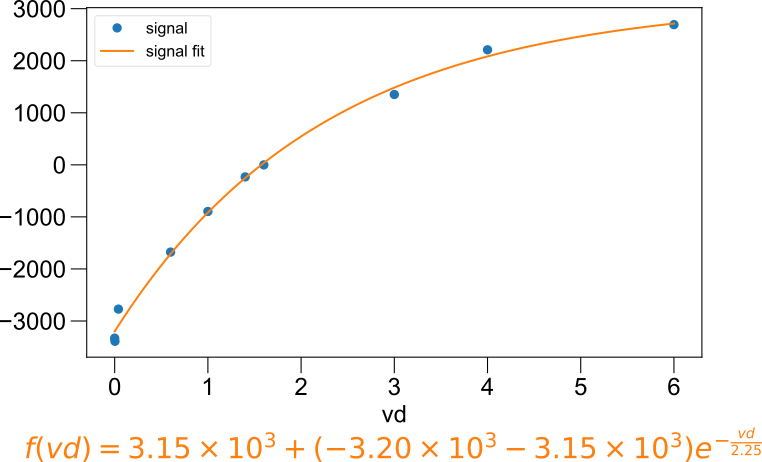
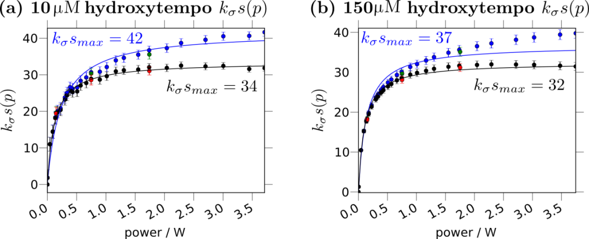
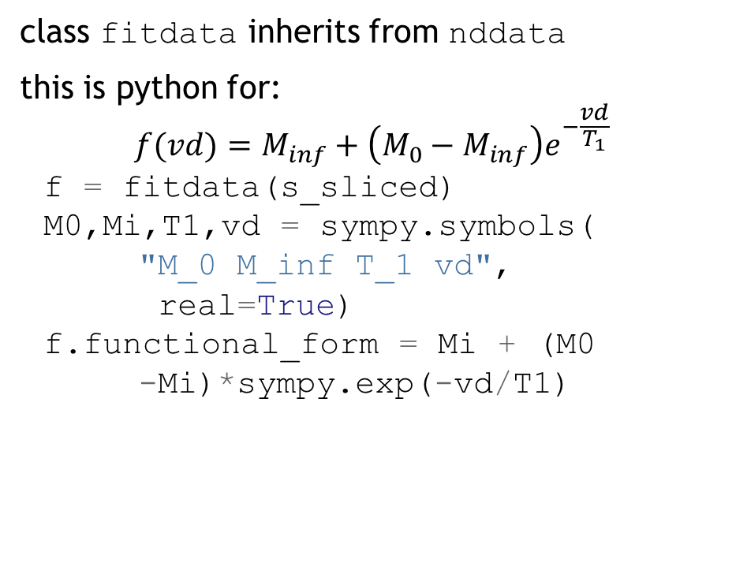

the lmfitdata class
===================

This is a child class of nddata used for fitting.

It works with two other very useful packages
lmfit -- which does a very good job of setting
up bounded fits -- and sympy -- which we can use
to represent the function that we are fitting.

Bounds improve the likelihood that our fit will converge,
while the symbolic representation both helps us to
generate latex representations of the function that we are fitting
and to *improve performance and error estimates* by automatically
calculating the jacobian.

You simply wrap your existing nddata with `lmfitdata`, set the
`functional_form` property to the equation you want to fit,
and provide guesses and bounds with `set_guess`.
The easiest way to get started is to see the fitting examples in
the example gallery.  A few typical ``lmfitdata`` results are
illustrated here.

   A simple T₁ relaxation fit.

   Fitting also handles global DNP buildup data at different concentrations.

   A ``fitdata`` subclass can also be defined in its own module.

.. currentmodule:: pyspecdata.lmfitdata

.. autosummary::
    :toctree: generated
    ~lmfitdata

.. autoclass:: lmfitdata
    :members:

